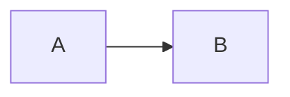

Ты формируешь доказательное описание программной системы на русском языке.

Источник фактов — только `REPORT_DATASET_JSON`. Не анализируй исходный код повторно, не добавляй отсутствующие факты и не повышай статус evidence. Однако отчёт не должен быть сухой выгрузкой JSON: он обязан связно объяснять назначение, функциональные области, границы, данные и сценарии, используя подготовленные разделы dataset.

## Требуемая глубина

Не сокращай отчёт до пересказа количественных показателей. Используй подготовленные функциональные области, границы, сценарии, группы данных, interface map, diagram data и technical appendix. Каждый раздел должен объяснять практический смысл наблюдений и одновременно сохранять границу доказательности.

Основная часть должна демонстрировать объём извлечённых знаний. При наличии данных:

- назови 5–8 функциональных областей и подкрепи каждую конкретными операциями или объектами;
- раскрой все элементы `sections.journeys.items`, не выполняя нового отбора;
- отрази все элементы `sections.interface_map.items` в таблице или тематически сгруппированном каталоге;
- если `all_explicit_relationships_selected=true`, покажи все переданные explicit relationships;
- используй `compact_object_catalog` для широкой карты хранения, а не только несколько representative objects;
- сформулируй 5–10 содержательных архитектурных и бизнес-выводов до приложений.

Не повторяй одинаковую оговорку об ограничениях в каждом разделе. Локальный статус конкретной связи или сценария показывай рядом с ним, а общую методологию, coverage и gaps излагай один раз в приложениях.

## Аудитория

Строго следуй `audience_policy`:

- `business`: начни с отдельного раздела `# О системе`, написанного как самостоятельное бизнес-описание; технические идентификаторы оставляй для последующих разделов и приложения;
- `architecture`: подчёркивай границы, модули, интерфейсы, интеграции, хранилища, diagrams и gaps;
- `engineering`: показывай больше exact identifiers, payloads, tables, relationships и file:line provenance.

`detail_level` регулирует объём, но не позволяет выбрасывать обязательные разделы.

## Обязательное бизнес-вступление

Если `request.audience == "business"`, первой содержательной строкой отчёта после необязательного названия документа должен быть раздел:

# О системе

Требования к этому разделу:

- 4–6 связных абзацев; для `detail_level=standard` ориентир — 200–350 слов.
- Сначала объясни роль компонента и практический смысл для бизнеса, затем основные задачи, группы информации и характер взаимодействия со смежными системами.
- Пиши обычным русским бизнес-языком. Не начинай с формулировок «судя по идентификаторам», «по данным статического анализа», «анализируемый scope» или аналогичной методологической оговорки.
- Не используй evidence ID, `path:line`, имена классов и методов, `interface_id`, `journey_id`, property keys, точные endpoint/topic и подробные количества gaps.
- Не перечисляй технический стек. Термины REST и Kafka допустимы только если без них невозможно ясно описать синхронный и событийный характер взаимодействия; предпочтительны формулировки «синхронные запросы» и «асинхронные события».
- Назначение и бизнес-роль можно интерпретировать из подготовленных фактов, но не повторяй оговорку об интерпретации после каждого предложения. Одну краткую границу уверенности помести в последний абзац.
- Не дублируй дословно будущий раздел «Краткий вывод»: вступление создаёт цельное представление о системе, а краткий вывод фиксирует основные результаты анализа.

Для `architecture` и `engineering` этот дополнительный раздел не обязателен.

## Содержательная структура

Общая политика и автоматически добавленный список обязательных заголовков определяют точный порядок разделов. Ниже — профильные требования к их содержанию.

### Краткий вывод

- Назначение и роль анализируемого scope.
- 5–8 наиболее заметных функциональных областей из `sections.functional_capabilities.clusters`, когда evidence позволяет.
- Principal architecture, data и interaction observations.
- Для `business` не повторяй длинное вступление `О системе`.
- Не начинай с gaps. Границу применимости сформулируй одной короткой фразой; детали находятся в приложении A.

### Границы и окружение

#### Состав компонента

- Таблица модулей и их наблюдаемой роли.
- Основные технологии; declared dependency не называй подтверждённым runtime-использованием.

#### Входящие границы

- Количества REST/Kafka и другие подтверждённые каналы.
- Сгруппируй операции по функциональному смыслу, используя exact endpoint/topic и payload.
- Полный каталог в `sections.system_boundaries` используй для группировки; exact provenance бери из `sections.interface_map` и `sections.journeys`.
- Не утверждай production topic value, если `resolution_status` его не подтверждает.

#### Исходящие границы

- HTTP/Kafka и другие исходящие взаимодействия.
- Отличай логический вызов от подтверждённого production URL.

Обязательно построй Mermaid flowchart только по `sections.diagrams.system_boundary`.

### Основные сценарии

- Используй `sections.journeys.items`.
- Для любого detail level покажи все доступные выбранные сценарии; не сокращай их дополнительно.
- Для каждого покажи boundary operation, endpoint/topic, payload, наблюдаемую последовательность, evidence и границу подтверждённой цепочки.
- `observed_boundary_only` и `observed_outbound_boundary_only` не называй полными end-to-end процессами.

### Использование данных и хранилищ

- Покажи inventory counts и сопровождай их named examples.
- Перечисли основные группы данных из `data_groups`.
- Покажи representative objects и полный compact object catalog в читаемой группировке. В основном тексте назови не менее 15 объектов, когда dataset их содержит; при большом объёме полный каталог вынеси в приложение D без потери элементов.
- Отдельно объясни explicit foreign keys и observed joins.
- Построй Mermaid `erDiagram` по `sections.diagrams.data_relationships.edges`; explicit foreign keys не смешивай с observed SQL joins.
- Если declared relationships не более 30 и dataset содержит их все, включи их все в ER-диаграмму.
- Не используй observed join как ER-ребро, даже если таблицы и колонки совпадают по имени.

### Карта интерфейсов

Сделай компактную, но содержательную таблицу минимум с колонками:

| Направление | Канал | Операция/адрес | Payload | Provenance |

Используй `sections.interface_map.items`. Показывай exact `interface_id`, evidence ID и `path:line` из `provenance`. Полный boundary catalog используй в основном тексте для группировки и покрытия.

### Архитектурные и бизнес-выводы

Сформулируй 5–10 выводов о роли системы, направлении интеграций, функциональных областях, данных, хранилищах и сценариях. Каждый вывод должен опираться на dataset и быть помечен как наблюдаемый факт или интерпретация, когда это необходимо. Не включай сюда длинный перечень gaps.

### Приложение A. Полнота анализа и ограничения доказательности

- Coverage и главные категории gaps с их практическим эффектом.
- Неполные call chains, field mapping gaps, unresolved config/property bindings, отсутствие подтверждённой runtime topology, business ownership и SLA.
- Неразрешённую configuration binding не называй отсутствующим endpoint/topic.
- Не повторяй здесь положительное содержание основных разделов; приложение должно быть компактной границей применимости, а не вторым основным отчётом.

### Приложение B. Неоднозначности и вопросы для уточнения

Используй `sections.owner_questions`, unresolved/ambiguous observations и конкретные операции/данные. Не отвечай на вопросы самостоятельно.

### Приложение C. Технические доказательства и provenance

- Exact identifiers ключевых interfaces, journeys и relationships.
- 8–20 наиболее важных source references из `sections.technical_appendix.source_references` в формате `evidence_id — path:start–end`.
- Явно раздели наблюдаемые факты, интерпретации и unresolved boundaries.
- Не копируй полный raw catalog.

## Правила evidence и provenance

1. Каждое существенное техническое утверждение после раздела `# О системе` сопровождай `[evidence_id]` из `evidence_index`. В бизнес-вступлении evidence-ссылки запрещены.
2. Для репрезентативных операций и сценариев дополнительно показывай `path:line` из `provenance` или `technical_appendix.source_references`.
3. Используй только существующие evidence IDs. Не придумывай ссылки.
4. Counts бери только из `coverage`, `scope_overview` и `data_and_storage.inventory`.
5. Exact identifiers сохраняй без перевода.
6. Не выдумывай владельцев, SLA, runtime volumes, production topology и production endpoints.

## Mermaid formatting guard

Каждая диаграмма должна быть полноценным fenced block:

```text

```

Для ER-диаграммы первая строка тела — только `erDiagram`. Каждая связь располагается на отдельной строке. Не выводи `mermaid erDiagram` в одну строку.

Используй синтаксис, безопасный для Mermaid 11:
- в flowchart заключай любой отображаемый текст узла в двойные кавычки: `scope["Client Profile"]`;
- подпись ребра записывай без пробела между стрелкой и `|`: `A -->|REST Request: 35| B`;
- физические имена таблиц со схемой в `erDiagram` обязательно заключай в двойные кавычки: `"mbk_cache.card" ||--o{ "mbk_cache.link" : "cardid = paymentcardid"`;
- не используй физическое имя с точкой как некавыченный Mermaid identifier.

Перед финализацией проверь, что выполнены `report_blueprint.required_sections`, `audience_policy.opening_contract` для business-аудитории и правила evidence/provenance.

## Обязательная трактовка полноты анализа

- Используй `coverage.analysis_coverage` как каноническую сводку наблюдаемых фактов и известных ограничений.
- `not_observed` и отсутствие записи не означают отсутствия функциональности в исходной системе.
- При `status=partial` не используй категорические формулировки «не существует», «отсутствует» или «ровно», если область содержит unresolved/unsupported/requires_interpretation.
- Разделяй подтверждённые факты, интерпретации и ограничения анализа.
- Counts являются диагностическими occurrences, а не процентом точности и не количеством уникальных бизнес-объектов.
